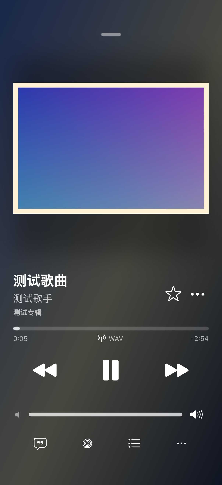
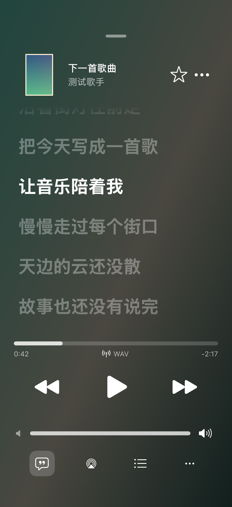
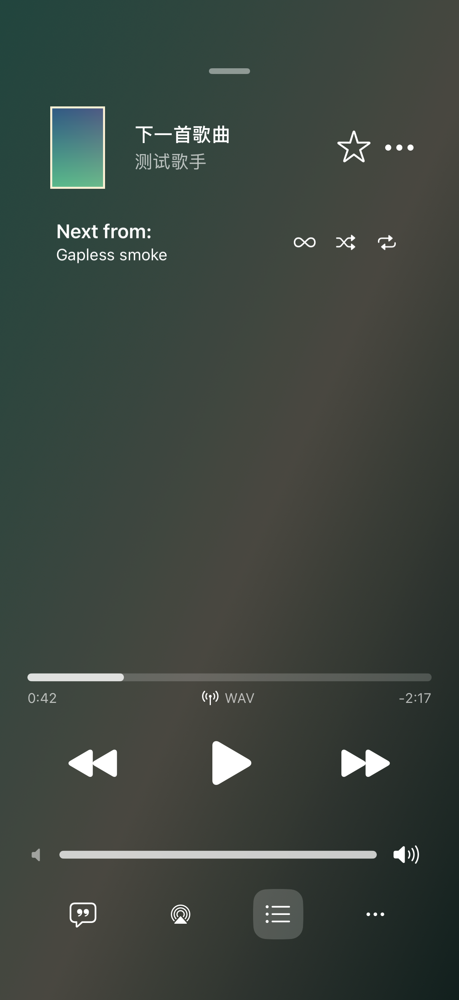

# qMusic for iOS

面向 iPhone 的自托管音乐播放器，连接 **Navidrome / Subsonic / Ampache** 音乐服务器。基于 [Amperfy](https://github.com/BLeeEZ/amperfy) 开发，采用接近 Apple Music 的播放器交互，支持简体中文与英语。

**当前版本：3.0 Beta 2** · **iOS 26 或更新版本**

[下载 3.0 Beta 2](https://github.com/liristy/amperfy/releases/tag/v3.0.0-beta.2) · [安装说明](docs/iphone-install-zh.md) · [更新记录](docs/releases/v3.0.0-beta.2.md)

## 播放器

 &nbsp;
 &nbsp;


以上为 iOS 模拟器演示截图，使用自动化验证的曲目与封面；具体界面以当前版本为准。

- 全屏播放器支持封面缩放打开、下滑退出，以及非正方形封面的完整显示。
- 歌词保留顶部曲目信息；播放队列中的历史、当前歌曲和播放模式随列表滚动，底部播放控制保持可用，避免标题与歌曲重叠。
- 播放／暂停图标居中缩小、切换后恢复，上一首／下一首提供切歌动效；快速连续点击也会回到正确状态。
- 音量条同步系统音量，按住后左右相对滑动调节，按下变粗、松手恢复；两侧图标保持水平对齐和相同亮度。
- 大封面点击不再打开队列，使用底部播放列表按钮进入；音量图标仅用于指示。
- 关闭循环和 **∞ 自动续播** 后，队列最后一首点击下一首会暂停并保留当前曲目。开启自动续播后，按服务器相似曲目与本地资料库补充独立的续播列表，手动添加的歌曲优先。
- 歌词自动高亮；上滑或等待后隐藏底部控制区，轻点恢复，点击顶部封面返回大封面。
- 迷你播放条跟随手指展示上一首／下一首，滑到一半可以退回取消；保留系统底部栏收起效果。
- 五角星收藏、记住随机播放选择、自动切歌同步更新曲目信息，以及封面加载完成后的锁屏信息更新。

## 音乐库与服务

- 默认资料库入口：艺人、专辑、歌曲、收藏、歌单、下载；默认主题色为橙色。
- Navidrome 歌单采用服务器提供的封面，支持封面缓存与离线显示。
- 多账号、离线下载、播放队列、均衡器、ReplayGain，以及适用格式的无缝播放。
- 向服务器提交正在播放与已听记录；ListenBrainz 等下游服务需在 Navidrome 服务端配置。
- 新增 [Maloja 聆听统计](docs/listening-statistics-zh.md)：总览、排行、趋势、历史、详情和资料库歌曲匹配播放；连接地址按音乐账号保存。
- 快捷指令动作：**定时停止播放**（0 分钟取消）和 **随机播放收藏**。
- 已移除评分与转码设置。

后台播放时暂停歌词和频谱的界面刷新，保留音频播放、锁屏信息和听歌记录更新。现有资源验证来自模拟器 CPU／内存采样，真机电池耗电量尚未测定。

## 安装

1. 从 [Releases](https://github.com/liristy/amperfy/releases) 下载 `qMusic-3.0.0-beta.2.ipa`。
2. 在 Windows 爱思助手中使用自己的 Apple ID 签名，再安装到 iPhone；细节见[安装说明](docs/iphone-install-zh.md)。
3. 打开 qMusic，登录自己的音乐服务器。

Release 中的 IPA 尚未使用个人证书签名。包内预建 Apple ad-hoc 签名结构，以兼容重签名工具；安装前仍需个人签名。更新时保持原 Apple ID 和应用标识，覆盖安装即可。App 内版本显示为 **3.0.0（2）**。

本仓库发布的 qMusic 是独立修改版，不是上游 Amperfy 的 App Store 版本。当前发布包不包含 Siri / CarPlay 的专用签名授权；快捷指令 App Intents 与 Siri 媒体授权是不同功能。

## 开发与验证

需要 macOS、Xcode 26（工作流使用 26.3）和 Swift 6；Windows 用户可使用 GitHub Actions 构建。

```sh
git clone https://github.com/liristy/amperfy.git
cd amperfy
open Amperfy.xcodeproj
```

选择 `Amperfy` scheme 构建。工程和 bundle identifier 保留原有名称，安装显示名称为 qMusic，以便现有侧载用户覆盖更新。

```sh
# iPhone 模拟器回归及界面检查（macOS）
bash BuildTools/test-iphone-changes.sh
# 生成待个人签名的真机 IPA（macOS）
bash BuildTools/build-unsigned-ipa.sh
# 检查重签名后的 IPA（Windows / macOS）
python BuildTools/verify_ipa.py --require-signature path/to/signed.ipa
```

播放器布局遵守[统一布局约定](docs/player-layout.md)。验证包括 184 项资料库与播放回归、iPhone 模拟器登录及完整界面检查，覆盖歌词、队列、原生玻璃、音量拖动、快速播放／暂停、自动续播、聆听统计、Scrobble 和快捷指令。模拟器验证不替代不同设备、服务器和个人签名环境的实际测试。

## 发布工作流

工作流 **qMusic Build & Release** 支持手动构建、PR 验证和 `v*` 标签发布，也支持通过主线的版本声明发起发布。普通主线推送不重复构建。

1. 更新 App 版本号、README、安装说明及 `docs/releases/<标签>.md`。
2. 将 `.github/release-version` 更新为目标标签（例如 `v3.0.0-beta.2`），随版本改动合入 `master`；该文件的主线变更会触发发布工作流。也可以在改动已进入 `master` 后直接推送 `v*` 标签。
3. 工作流重新完成全部测试、真机打包和完整性校验后，创建版本标签与 GitHub Release，附带 IPA、SHA-256、构建来源和安装说明。发布提交必须属于 `master`，已有标签不得移到其他提交；含预发行后缀的标签标记为 Pre-release。

临时 Actions artifacts 保留 7 天；已发布的文件可从对应 Release 下载。构建不需要上传 Apple ID、密码或个人签名证书。

## 开源来源

- qMusic 基于 [Amperfy](https://github.com/BLeeEZ/amperfy)，保留原作者版权声明并继续遵循 [GPL-3.0](LICENSE)。
- 应用图标与启动音符来自 [Feishin](https://github.com/jeffvli/feishin)，遵循其 GPL-3.0 许可；感谢两个上游项目及其贡献者。

## Attributions

- [AudioStreaming](https://github.com/dimitris-c/AudioStreaming) by [Dimitris C.](https://github.com/dimitris-c) is licensed under [MIT License](https://github.com/dimitris-c/AudioStreaming/blob/main/LICENSE)
- [MarqueeLabel](https://github.com/cbpowell/MarqueeLabel) by [Charles Powell](https://github.com/cbpowell) is licensed under [MIT License](https://github.com/cbpowell/MarqueeLabel/blob/master/LICENSE)
- [NotificationBanner](https://github.com/Daltron/NotificationBanner) by [Dalton Hinterscher](https://github.com/Daltron) is licensed under [MIT License](https://github.com/Daltron/NotificationBanner/blob/master/LICENSE)
- [ID3TagEditor](https://github.com/chicio/ID3TagEditor) by [Fabrizio Duroni](https://github.com/chicio) is licensed under [MIT License](https://github.com/chicio/ID3TagEditor/blob/master/LICENSE.md)
- [CoreDataMigrationRevised-Example](https://github.com/wibosco/CoreDataMigrationRevised-Example) by [William Boles](https://github.com/wibosco) is licensed under [MIT License](https://github.com/wibosco/CoreDataMigrationRevised-Example/blob/master/LICENSE)
- [VYPlayIndicator](https://github.com/obrhoff/VYPlayIndicator) by [Dennis Oberhoff](https://github.com/obrhoff) is licensed under [MIT License](https://github.com/obrhoff/VYPlayIndicator/blob/master/LICENSE)
- [CallbackURLKit](https://github.com/phimage/CallbackURLKit) by [Eric Marchand](https://github.com/phimage) is licensed under [MIT License](https://github.com/phimage/CallbackURLKit/blob/master/LICENSE)
- [DominantColors](https://github.com/DenDmitriev/DominantColors) by [Den Dmitriev](https://github.com/DenDmitriev) is licensed under [MIT License](https://github.com/DenDmitriev/DominantColors/blob/main/LICENSE)
- [AudioVisualizerKit](https://github.com/Kyome22/AudioVisualizerKit) by [Takuto NAKAMURA (Kyome)](https://github.com/Kyome22) is licensed under [MIT License](https://github.com/Kyome22/AudioVisualizerKit/blob/main/LICENSE)
- [Alamofire](https://github.com/Alamofire/Alamofire) by [Alamofire](https://github.com/Alamofire) is licensed under [MIT License](https://github.com/Alamofire/Alamofire/blob/master/LICENSE)
- [Ifrit](https://github.com/ukushu/Ifrit) by [Andrii Vynnychenko](https://github.com/ukushu) is licensed under [MIT License](https://github.com/ukushu/Ifrit/blob/main/LICENSE.md)
- [swift-collections](https://github.com/apple/swift-collections) by [Apple](https://github.com/apple) is licensed under [Apache License 2.0](https://github.com/apple/swift-collections/blob/main/LICENSE.txt)
- [iOS-swiftUI-spotify-equalizer](https://github.com/urvi-k/iOS-swiftUI-spotify-equalizer) by [urvi koladiya](https://github.com/urvi-k) is licensed under [MIT License](https://github.com/urvi-k/iOS-swiftUI-spotify-equalizer/blob/main/LICENSE)

**Amperfy license:** [GPLv3](https://github.com/BLeeEZ/Amperfy/blob/master/LICENSE)

**Special thanks:** [Dirk Hildebrand](https://apps.apple.com/us/developer/dirk-hildebrand/id654444924)
